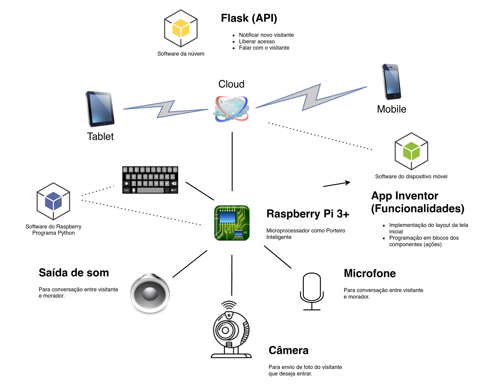

# Grupo Media

Trabalho Acadêmico

Professor: Claudio Pereira

Disciplina: Dispositivos Móveis e Internet das Coisas

Grupo: Márcia, Raniere, Rafaela e Thiago

Curso: MBA Machine Learning e IoT (UNIPÊ)

### Arquitetura: (Visão em alto nível)

